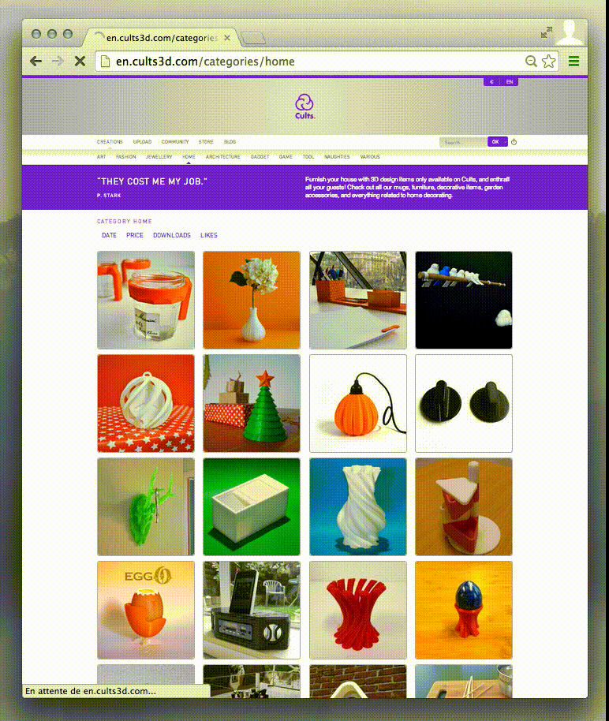

CarrierWave Processing DominantColor
======================================

Adds the dominant color of an image to your database whenever you upload it
with the CarrierWave gem.


Installation
------------

Add this line to your application's Gemfile:

```ruby
gem "carrierwave-processing-dominant_color"
```

And then execute:

```sh
$ bundle
```

Add the dominant color attribute
--------------------------------

On the Rails model where you attach your uploader, you need a `dominant_color=`
attribute. Create a migration by replacing "Articles" with your table name in the
following command:

```sh
$ rails g migration AddDominantColorToArticles dominant_color
$ rake db:migrate
```


Add the processor in your uploader
----------------------------------

In your uploader, include the module and call the processor:

```ruby
class PhotoUploader < CarrierWave::Uploader::Base
  include CarrierWave::Processing::DominantColor

  process :store_dominant_color

  # …
end
```

If you do any resizing or if you have several versions of your uploader,
add it after you have resized the smallest version so that processing goes
faster. For example:

```ruby
# …
version :medium do
  process resize_to_fill: [200, 200]
end

version :thumb, from_version: :medium do
  process resize_to_fill: [42, 42]
  process :store_dominant_color
end
# …
```


Using your dominant color
-------------------------

An easy way of using your dominant colors is to put them as a background to your
image tags:

```erb
<%= image_tag(article.photo.url(:thumb), style: "background: #{article.dominant_color}") %>
```

For example, on [cults3d](http://cults3d.com):



Contributing
------------

1. Fork it ( https://github.com/sunny/carrierwave-processing-dominant_color/fork )
2. Create your feature branch (`git checkout -b my-new-feature`)
3. Commit your changes (`git commit -am 'Add some feature'`)
4. Push to the branch (`git push origin my-new-feature`)
5. Create a new Pull Request
